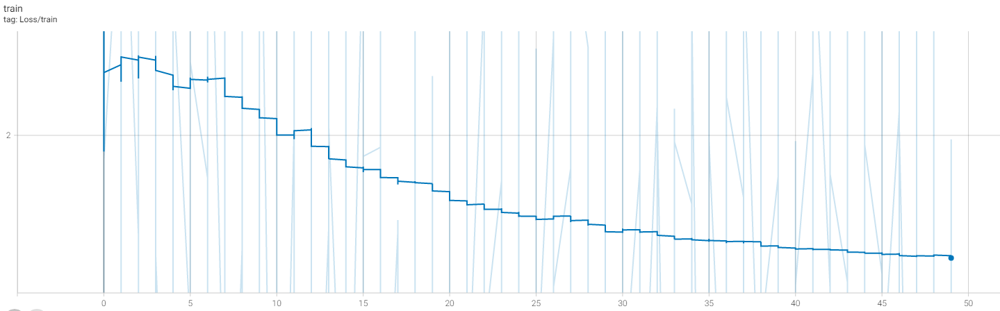

# Facebook Marketplace Recommendation Ranking System

This is one of the specialisation projects from the AICore curriculum, and is a work in progress.

Some details of the (vastly simplified version of the) system being cloned are explained in this video here: https://www.youtube.com/watch?v=1Z5V2VrHTTA

Essentially though, the outputs of a CNN trained for classification of product images can also be used to determine how similar too images are. It's almost saying "this image of a product is 90% fridge-like and so the user may also like this other one that's 91% fridge and this one that's 89% fridge" - this means that if a person can subconsciously narrow their search - picking out unknown details rather than explicit ones. Facebook won't know that what the user is looking for a car that looks like a fridge - but they'll know what products to show them next.

# Milestone 1 & 2

Overview and connections to git & aws

  

# Milestone 3

1) Connect to EC2 download sample data, import and clean it.
	- tabular data cleaning done on [a Jupyter Notebook](https://github.com/MartinKlefas/facebook-marketplaces-recommendation-ranking-system/blob/fa2934bf4db916fd06c2b923ba89367a97ad098a/Data_Import_&_Clean.ipynb) to test options quickly
		- chosen methods then pulled into `clean_tabular_data.py`
	- image cleaning done using the Pillow library
		- Images had different bitrate and depths
		- Resizing and saving with default options will standardise this
		- code implemented in `clean_images.py`
2) Convert `Product Categories` into machine readable integers with a dictionary to act as a human readable key.

# Milestone 4
Create a vision model & feature extraction model - [implemented in a notebook as a one-off exploration](https://github.com/MartinKlefas/facebook-marketplaces-recommendation-ranking-system/blob/main/retrain.ipynb)
1) Import data into PyTorch
2) Strip output layer from ResNet 50 and replace with retrained layer
3) Create a pre-processor script for future images [image_processor.py](https://github.com/MartinKlefas/facebook-marketplaces-recommendation-ranking-system/blob/main/image_processor.py)
4) Verify that the CNN sometimes correctly predicts what root category an item will be in.

Output from training the feature extraction model is shown below:

> Written with [StackEdit](https://stackedit.io/).
